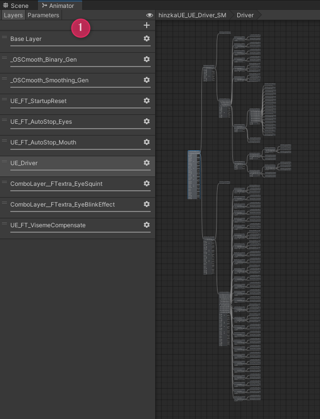
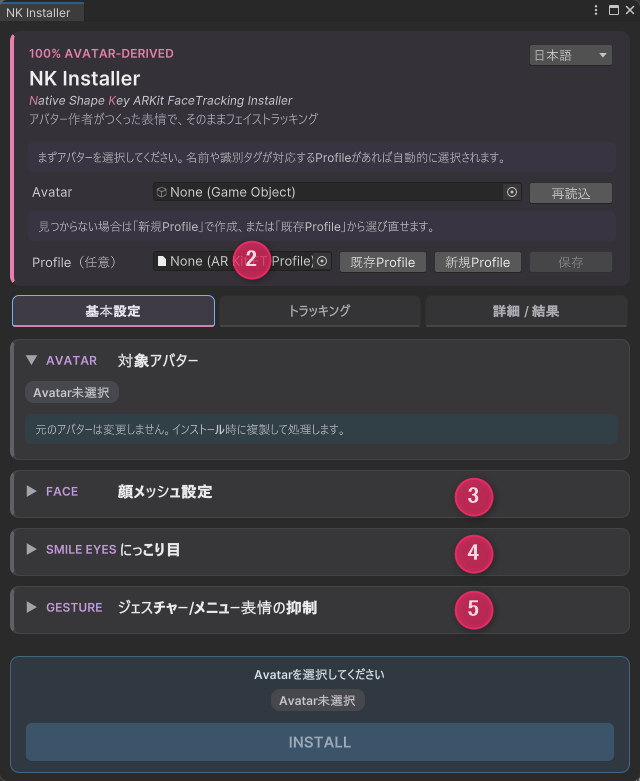
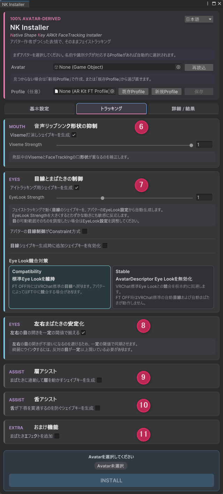
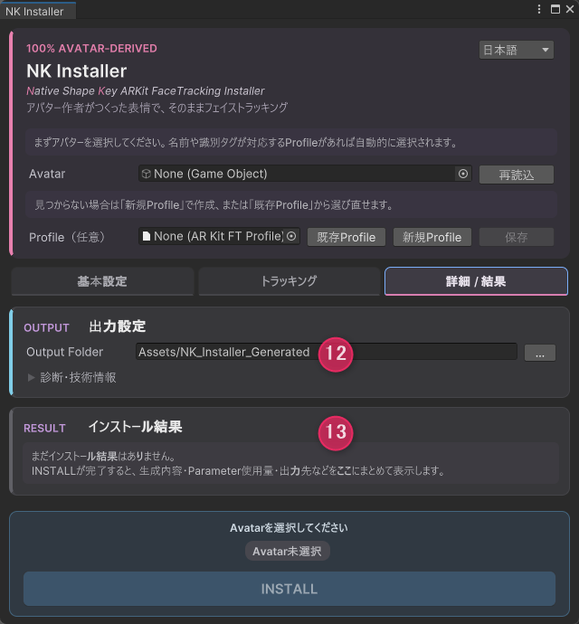

# NK Installer 機能概要

NK Installerは、VRChat用アバターに対し、VRChatおよびVRCFaceTracking(VRCFT)でのフェイストラッキング機能をセットアップするツールです。

フェイストラッキング用のシェイプキー(ARKit/PerfectSync)をあらかじめ持っているアバターを対象としています。

**注意事項**

- VRChat公式の「Selfie Expression」(Webカメラトラッキング)とは異なる機能です
- 利用には、VRCFTの導入と、フェイストラッキングに対応したデバイスが別途必要です

---

## ①テンプレートFX

**汎用FX**
アバターが持つARKitの表情をそのまま動かせる汎用のテンプレートを用意しました。

**パラメータの節約とスムージング**  
OSCmoothにより、フェイストラッキングで使用するパラメータ数を節約しながら、トラッキング値を平滑化してなめらかな動きに補正します。

**同期パラメータ**  
本ツールが消費する同期パラメータは **151bit** です。
アバター側にシェイプキーが不足していたり、エントリーのみで頂点移動が0だった場合、該当の表情の同期パラメータを削減できます。

## ② Profile管理

アバターごとの設定をProfileとして保存します。作成したProfileは配布することもできます。

## ③ 顔メッシュ指定

アバターによって異なる表情メッシュ名・階層構造・シェイプキーの接頭辞(Prefix)に対応します。
フェイストラッキングに必要なシェイプキーを自動検知します。

## ④ にっこり目

笑顔の目（両目にっこり）を、既存のシェイプキーから選択できます。

## ⑤ ジェスチャー/メニュー表情の抑制

ジェスチャーによる表情切り替えを抑制し、フェイストラッキングとの競合による表情の破綻を回避します。

## ⑥ 音声リップシンク形状の抑制

`AvatarDescriptor`の情報をもとにViseme打消しシェイプキーを生成し、Visemeとフェイストラッキングとのオーバーラップによる口元の破綻を回避します。

## ⑦ 目線・まばたきの制御

標準EyeLookとフェイストラッキングとのオーバーラップによる、目元の破綻や目線の混入を回避します。`AvatarDescriptor`の情報をもとに目線シェイプキーを生成し、アイトラッキングによる目線制御を行います。アバターの目線にConstraintが使われている場合も、目線シェイプキーを作成できます。

必要に応じて、アイトラッキングの目線とジェスチャー表情を併用できるような構成にしています。競合が解決できないケースでは、標準のEyeLook自体をオフにします。

## ⑧ 左右まばたきの安定化

目の開きを一定の閾値で同期し、左右の目の開きが歪になるのを回避します。オプションで同期をオフにすることもできます。

## ⑨ 眉アシスト

眉のトラッキング機能がないデバイス向けに、目元の動きに連動して眉を動かすオプションです。

## ⑩ 舌アシスト

舌を持ち上げるシェイプキーを生成し、舌が出る途中で下唇を貫通してしまうのを回避します。

## ⑪ おまけ機能

まばたきで揺れる瞳ハイライトエフェクト用に、アニメーションクリップを追加できるスロットを用意しています。

## ⑫ 個別フォルダ出力

Installのたびに新しいフォルダを生成し、必要なデータを格納します。既存の環境を汚さずにInstallできます。

## ⑬ Install結果レポート

Install結果の一覧を表示します。
