# NK Installer 使い方

## Profile作成済アバターの場合

アバターをドラッグ＆ドロップし、**Install**ボタンをクリックするだけでセットアップが完了します。

### 1. 対象アバター登録

対応するProfileが自動選択され、登録済みの内容が反映されます。

### 2. Installボタン押下

変換後のアバターがScene上に生成されます。VRChatにアップロードが可能です。

※Avatar OptimizerのTrace And Optimizeのアタッチをおすすめします。不要なシェイプキー等を削除してアバターのデータを自動的に軽量化することができます。

Scene上のアバターから変換した場合、元アバターは非表示になります。処理結果は「詳細/結果」タブにレポート表示されます。

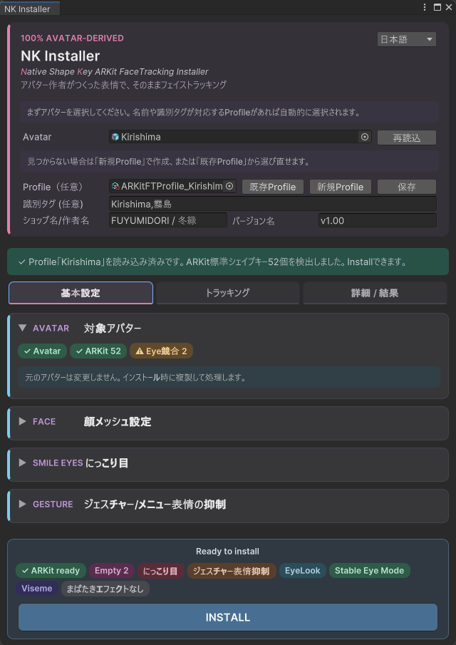

---

## Profile未作成アバターの場合

以下の手順で設定し、新規Profileを作成してください。

### 1. 対象アバター登録・顔メッシュ指定

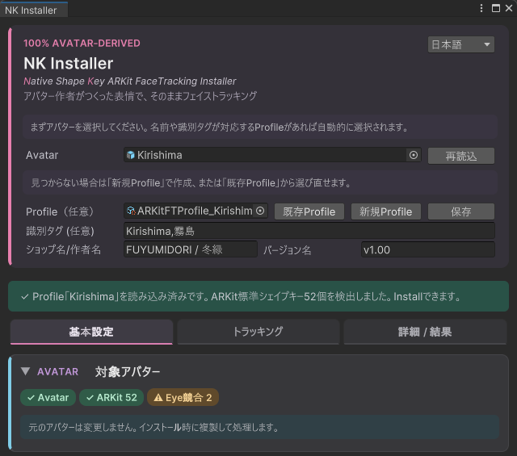

最初に、Avatar欄にアバターをセットします。`AvatarDescriptor`が設定されたHumanoidアバターである必要があります。Project内のアバターPrefabでも、Scene上のアバターオブジェクトでも構いません。

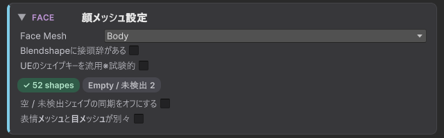

該当アバターの`SkinnedMeshRenderer`名の一覧がプルダウンメニューに表示されます。表情シェイプキーを含むメッシュオブジェクトを選択してください。選択したメッシュが持つシェイプキー名を自動検索し、検出したARKitシェイプキー数をカウント表示します。

### 2. にっこり目

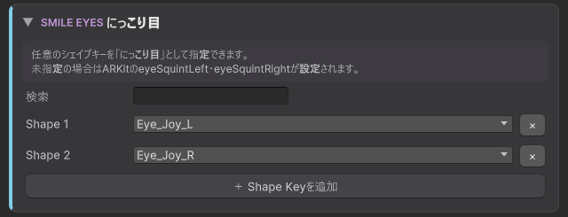

「にっこり笑う両目」で発動する目元のシェイプキーを登録します。まばたきとは排他で動作します。

手順1で指定したメッシュが持つシェイプキーをプルダウンリストから選択します。ウインクするシェイプキーを左右合成して登録することもできます。

### 3. ジェスチャー/メニュー表情の抑制

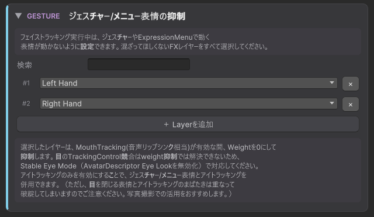

アバター本来のFXから、フェイストラッキング実行中に抑制したいレイヤーを指定します。

- ほとんどのアバターは右手・左手のジェスチャーで表情を制御しているので、該当するレイヤーを探して登録してください
- ExpressionMenuから手動で表情切り替えしているレイヤーも探して登録してください

Mouthトラッキングを有効にしている間、指定したレイヤーのウエイトを0に設定します（該当レイヤーで制御しているAnimationクリップの表情変化が無効になります）。
Mouthトラッキングを無効にすると、再び本来の表情変化が有効になります。

アイトラッキングのみをオンにすることで、アイトラッキングとジェスチャー/メニュー表情を併用できます。

TrackingControlが使われているレイヤーを検出すると、タグで表示されます。TrackingControlはウエイトを0にしても動作してしまうため、ジェスチャーのたびに目線が不安定になることがあります。この場合は「目線・まばたきの制御」でStableモードを選択し、標準EyeLookをオフにすることをおすすめします。

詳しくは[ジェスチャー/メニュー表情の抑制](gesture_suppression_explanation.md)を参照してください。

### 4. 音声リップシンク形状の抑制

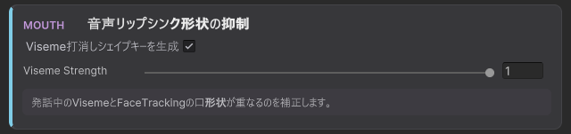

`AvatarDescriptor`の情報をもとに、Viseme打消しシェイプキーを生成します。`AvatarDescriptor`にVisemeが設定されていない場合は何も行いません。

詳しくは[Viseme打消しシェイプキー生成](viseme_compensation_explanation.md)を参照してください。

### 5. 目線・まばたきの制御

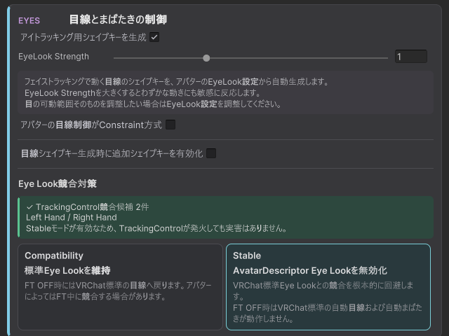

`AvatarDescriptor`の情報をもとに、目線シェイプキーを生成します。`AvatarDescriptor`にEyeLookが設定されていない場合は何も行いません。

詳しくは[目線とまばたき](eyelook_shapekey_explanation.md)を参照してください。

### 6. 左右まばたきの安定化

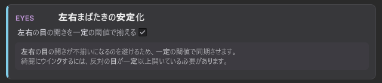

デバイスによっては左右の目のトラッキングにばらつきが出てしまい、片目だけ半目になってしまう場合があります。
このような不自然な目つきを抑制するため、左右の目の開きを一定の閾値で補正します。
ウインクをする際は、反対側の目をある程度開いている必要があります。
チェックをオフにすることで、左右のまばたきを完全に独立させることができます。

### 7. 眉アシスト

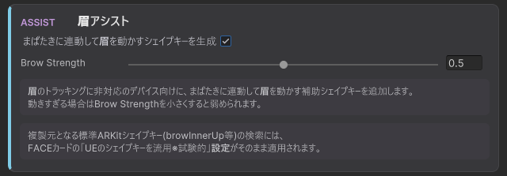

眉トラッキング機能のないデバイスで、目の見開きに連動して眉を動かします。

### 8. 舌アシスト

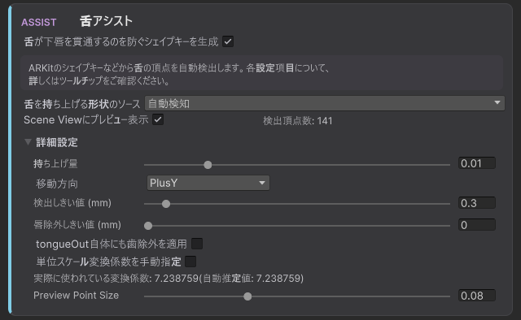

舌を持ち上げるシェイプキーを自動作成し、舌が出る途中で下唇を貫通してしまうのを回避します。チェックがOFFの場合、舌を出すと`tongueOut`がそのまま動作します。

既存シェイプキーに舌を上げるものがあれば、リストから直接登録できます。
適切な既存シェイプキーがない場合は、`tongueOut`等から自動検出して生成することもできます。

詳しくは[舌アシスト機能](tongue_assist_explanation.md)を参照してください。

### 9. おまけ機能

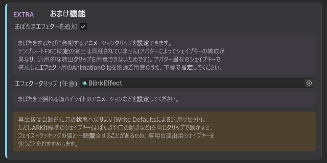

まばたきでうるうる揺れる瞳ハイライトなど、演出用のアニメーションクリップを登録できます。

### 10. Profile保存

「新規作成」ボタンで作成します。

識別タグを記述しておくと、同一名称のアバターが設定された際に自動的にこのProfileが選択されます。任意で、ショップ名/作者名・バージョン名をメタデータとして登録することもできます。

### 11. Installボタン押下

変換後のアバターが生成されます。VRChatにアップロードが可能です。

※Avatar OptimizerのTrace And Optimizeのアタッチをおすすめします。不要なシェイプキー等を削除してアバターのデータを自動的に軽量化することができます。

Scene上のアバターから変換した場合、元アバターは非表示になります。処理結果は「詳細/結果」タブにレポート表示されます。
